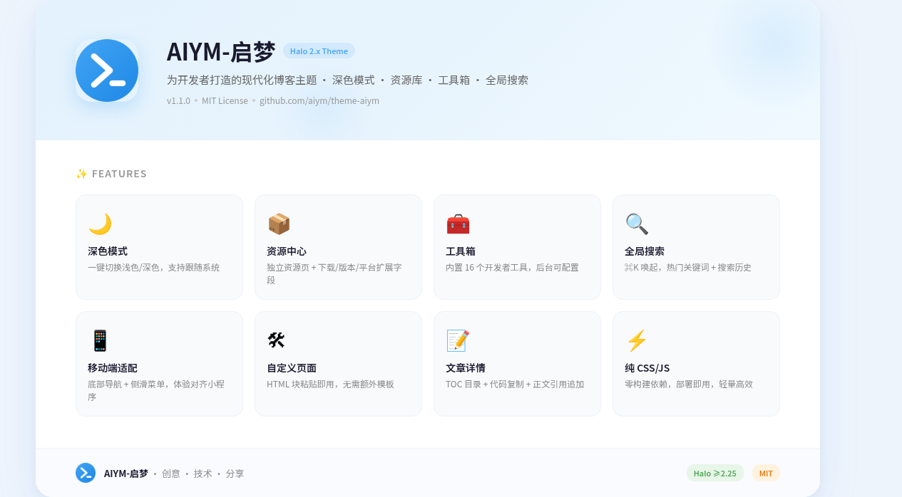

# AIYM-启梦

> 为开发者打造的现代化 Halo 2.x 博客主题




## ✨ 特性

- 🎨 **浅色 / 深色模式** — 一键切换，支持跟随系统
- 📱 **完美移动端适配** — 底部导航 + 侧滑菜单，移动端体验对齐小程序
- 🔍 **全局搜索弹窗** — `⌘/Ctrl + K` 唤起，支持搜索历史 + 热门关键词
- 📦 **资源库中心** — 独立资源页 + 资源文章模板，支持下载链接、版本、平台等扩展字段
- 🧰 **在线工具箱** — 16 个开发者常用工具，自定义页面自动读取，后台 annotations 配置
- 🛠 **自定义页面模板** — 工具详情页 `tool-detail` 模板，共享 CSS/JS，手机端完美适配
- 📝 **文章详情页** — TOC 侧边栏 / 悬浮面板、代码复制、图片预览、正文引用追加
- 🎯 **分类筛选** — 首页分类标签切换，支持无限滚动加载
- ⚡ **纯 CSS/JS** — 无构建依赖，部署即用
- 🔒 **SEO 优化** — Open Graph、结构化数据、备案信息自动展示
- ♿ **无障碍支持** — 语义化 HTML、键盘导航、屏幕阅读器兼容

## 📦 安装

1. 下载主题包（`.zip` 格式）
2. 登录 Halo 后台 → **外观** → **主题** → **安装主题**
3. 上传主题包文件，等待安装完成
4. 启用主题，配置各项设置

## ⚙️ 配置说明

### 内容设置

| 选项 | 说明 |
|------|------|
| 博客根分类 | 首页只显示此分类及其子分类下的文章 |
| 资源根分类 | 资源中心只显示此分类及其子分类下的资源 |
| 每页文章数 | 列表页每页文章数（默认 12） |
| 热门文章数 | 首页热门文章数量（默认 6） |
| 随机封面图库 | 文章无封面时从这些图片中随机选取 |

### 外观设置

| 选项 | 说明 |
|------|------|
| 默认模式 | 跟随系统 / 浅色 / 深色 |
| 主题色 | 自定义品牌色（按钮、链接、激活状态等自动跟随） |
| 主题色（深色） | 悬停态使用的深色版本 |
| 主题色（浅色背景） | 标签背景、高亮等使用的浅色版本 |
| 启用动画 | 控制页面过渡动画 |

### 资源设置

| 选项 | 说明 |
|------|------|
| 下载按钮文字 | 自定义下载按钮文本 |
| 补充说明（Markdown） | 资源文章末尾显示的使用说明/免责声明 |

### 工具箱设置

工具箱页面自动读取路径以 `/tools/` 开头的自定义页面，无需手动配置工具列表。

每个工具通过页面 Annotations 配置：

| Annotation Key | 说明 | 示例 |
|----------------|------|------|
| `tools.icon` | Iconify 图标 ID | `mdi:code-json` |
| `tools.cat` | 分类名称 | `开发`、`编码`、`转换` |
| `tools.color` | 图标颜色 | `#4caf50` |
| `tools.bg` | 图标背景色 | `#e8f5e9` |
| `tools.sort` | 排序序号（数字越小越靠前） | `0` |

工具名称取自页面标题，简介取自页面摘要（excerpt）。

外部 https 链接工具可在主题设置中手动添加。

## 📋 内置页面模板

### 资源中心（`resources`）

独立资源页面，包含：
- Hero 区域 + 推荐资源横滑卡片
- 全部资源列表（无限滚动）
- 分类筛选
- 后台创建单页面时选择 `resources` 模板

### 工具箱（`toolbox`）

开发者工具聚合页面，包含：
- 搜索 + 分类筛选
- 工具卡片网格（响应式 2→3→4→5 列）
- 从 API 动态读取工具数据
- 外部链接自动新窗口打开
- 后台创建单页面时选择 `toolbox` 模板

### 工具详情页（`tool-detail`）

单个工具的展示页面，包含：
- 共享 CSS/JS（`tool-common.html`）
- 手机端完美适配（padding 与 toolbox 一致）
- 后台创建单页面时选择 `tool-detail` 模板

### 关于页面（`about`）

简约风格个人介绍页面，支持：
- 自动读取站点信息
- 页面编辑器内容
- 联系方式（pipe 格式配置，后台可管理）
- 后台创建单页面时选择 `about` 模板

## 🧰 内置工具列表

| 工具 | 说明 | 图标 |
|------|------|------|
| JSON 格式化 | 树形视图 + 格式化 / 压缩 / 转义 | `mdi:code-json` |
| Base64 编解码 | 文本 ↔ Base64 互转 | `mdi:file-code` |
| URL 编解码 | URL 编码 / 解码 | `mdi:link` |
| 时间戳转换 | Unix 时间戳 ↔ 可读日期 | `mdi:calendar-clock` |
| 正则测试 | 正则表达式测试 + 匹配高亮 | `mdi:regex` |
| 颜色转换 | HEX / RGB / HSL 互转 | `mdi:palette` |
| 二维码生成 | 输入内容生成二维码 | `mdi:qrcode` |
| ID 生成器 | UUID / Nano ID / 短 ID | `mdi:identifier` |
| Hash 计算 | MD5 / SHA（Web Crypto API） | `tabler:hash` |
| 密码生成 | 自定义长度 + 字符类型 | `mdi:shield-key` |
| 文本对比 | 两段文本差异对比 | `tabler:file-diff` |
| Markdown 预览 | 实时 Markdown 渲染 | `mdi:language-markdown` |
| Cron 解析 | Cron 表达式 → 可读描述 | `mdi:timer-cog` |
| JWT 解码 | JWT Token 解码 | `mdi:key-variant` |
| 大小写转换 | 各种大小写格式转换 | `mdi:format-letter-case` |
| 进制转换 | 二/八/十/十六进制互转 | `mdi:code-braces` |

工具**不是主题内置的**，需要手动创建自定义页面（使用 `tool-detail` 模板）。

## 🔧 资源文章字段

资源类文章通过文章注解（Annotation）扩展字段：

| 注解 Key | 说明 |
|----------|------|
| `theme.aiym.fun/download-url` | 下载地址 |
| `theme.aiym.fun/icon-url` | 图标地址 |
| `theme.aiym.fun/version` | 版本号 |
| `theme.aiym.fun/platform` | 平台（如 Windows, macOS） |

兼容旧 Key：`downloadUrl`、`iconUrl`、`version`、`platform`

## 📐 菜单图标

导航菜单支持 Iconify 图标注解，在 Halo 后台编辑菜单项 → **自定义属性**中设置：

- `icon`: Iconify 图标名，如 `ri-home-line`、`ri-article-line`
- `animation`: 设为任意值启用悬停动画

图标列表：[Iconify 图标搜索](https://icon-sets.iconify.design/)

## 🎨 目录结构

```
theme-aiym/
├── theme.yaml                  # 主题元数据（注册 tool-detail 模板）
├── settings.yaml               # 主题设置定义
├── annotation-setting.yaml     # 文章注解设置
├── screenshot.png              # 主题截图
├── README.md
└── templates/
    ├── index.html              # 首页（文章列表 + 分类筛选）
    ├── post.html               # 文章详情（资源/普通共用）
    ├── page.html               # 独立页面
    ├── page_tool_detail.html   # 工具详情页模板
    ├── page_resources.html     # 资源中心独立页
    ├── page_toolbox.html       # 工具箱聚合页（API 动态读取）
    ├── page_about.html         # 关于页面
    ├── category.html           # 分类页
    ├── archives.html           # 归档页
    ├── tags.html               # 标签页
    ├── error/                  # 错误页
    │   ├── 404.html
    │   └── 500.html
    ├── modules/
    │   ├── layout.html         # 全局布局 + CSS + 搜索弹窗
    │   ├── head.html           # head 标签（SEO）
    │   ├── header.html         # 页头（三栏：Logo + tabbar + 用户）
    │   ├── footer.html         # 页脚（备案 + 版权）
    │   ├── tool-common.html    # 工具共享 CSS/JS
    │   └── mobile-nav.html     # 移动端导航
    └── assets/
        ├── css/style.css       # 主样式
        └── js/
            ├── main.js         # 主题管理 / 搜索 / TOC / 代码复制
            └── iconify.js      # Iconify 图标库加载
```

## 🚀 快速开始

### 创建工具箱页面

1. Halo 后台 → 页面 → 新建
2. 标题填 `工具箱`，路径填 `tools`
3. 模板选择 `toolbox`
4. 保存 → 发布

### 创建资源中心页面

1. Halo 后台 → 内容 → 单篇页面 → 新建
2. 标题填 `资源中心`，路径填 `resources`
3. 模板选择 `resources`
4. 保存 → 发布

### 创建工具页面

工具**不是内置的**，需要手动创建自定义页面。每个工具是一个独立的 HTML 页面，使用 `tool-detail` 模板，需要工具可以自定义对应工具

**步骤：**

1. Halo 后台 → 内容 → 单篇页面 → 新建
2. 标题填工具名（如 `JSON 格式化`），路径填 `tools/json`
3. 模板选择 `tool-detail`
4. 内容切换到 **HTML 模式**，粘贴工具 HTML 代码（见下方示例）
5. 设置页面**摘要**（excerpt）为工具简介（如 `JSON 校验、压缩、转义`）
6. 在页面 **Annotations** 中添加配置：
   - `tools.icon`: `mdi:code-json`（Iconify 图标 ID）
   - `tools.cat`: `开发`（分类名称）
   - `tools.color`: `#4caf50`（图标颜色）
   - `tools.bg`: `#e8f5e9`（图标背景色）
   - `tools.sort`: `0`（排序序号，数字越小越靠前）
7. 保存 → 发布

工具会自动出现在工具箱页面中。

**示例代码（Base64 编解码工具）：**

```html
<style>
.tool-page{max-width:1100px;margin:0 auto;padding:16px 0;font-family:-apple-system,BlinkMacSystemFont,"PingFang SC","Microsoft YaHei",sans-serif}
.tool-panels{display:grid;grid-template-columns:1fr 1fr;gap:12px;min-height:300px}
@media(max-width:767px){.tool-panels{grid-template-columns:1fr}}
.tool-card{background:var(--color-bg-secondary);border-radius:14px;border:1px solid var(--color-border-primary);overflow:hidden;display:flex;flex-direction:column}
.tool-card-header{display:flex;justify-content:space-between;align-items:center;padding:12px 16px;border-bottom:1px solid var(--color-border-primary)}
.tool-card-title{font-size:13px;font-weight:600;color:var(--color-text-secondary)}
.tool-card-body{padding:12px 16px;flex:1;display:flex;flex-direction:column}
.tool-textarea{width:100%;flex:1;min-height:200px;padding:10px 14px;font-size:14px;font-family:'SF Mono','Menlo',monospace;background:var(--color-bg-tertiary);border:1.5px solid var(--color-border-primary);border-radius:var(--radius-md);color:var(--color-text-primary);outline:none;resize:vertical;line-height:1.6;box-sizing:border-box}
.tool-textarea:focus{border-color:var(--color-brand);box-shadow:0 0 0 3px var(--color-brand-glow)}
.tool-card-footer{padding:8px 16px;border-top:1px solid var(--color-border-primary)}
.tool-stats{font-size:12px;color:var(--color-text-muted)}
.tool-btn-group{display:flex;gap:6px;margin:12px 0}
.tool-btn{padding:8px 16px;border-radius:8px;font-size:13px;font-weight:500;cursor:pointer;border:1.5px solid var(--color-border-primary);background:var(--color-bg-secondary);color:var(--color-text-primary);transition:all .15s;font-family:inherit}
.tool-btn:hover{border-color:var(--color-brand);color:var(--color-brand)}
.tool-btn.primary{background:var(--color-brand);color:#fff;border-color:var(--color-brand)}
.tool-btn.primary:hover{opacity:.9}
</style>

<div class="tool-page">
  <div class="tool-panels">
    <div class="tool-card">
      <div class="tool-card-header">
        <span class="tool-card-title">输入</span>
      </div>
      <div class="tool-card-body">
        <textarea class="tool-textarea" id="input" placeholder="输入要编码/解码的文本..."></textarea>
      </div>
    </div>
    <div class="tool-card">
      <div class="tool-card-header">
        <span class="tool-card-title">结果</span>
      </div>
      <div class="tool-card-body">
        <div class="tool-textarea" id="output" style="cursor:pointer;min-height:200px" onclick="toolCopy(this.textContent)">输入内容后点击编码/解码</div>
      </div>
    </div>
  </div>
  <div class="tool-btn-group">
    <button class="tool-btn primary" onclick="encode()">编码 →</button>
    <button class="tool-btn" onclick="decode()">← 解码</button>
    <button class="tool-btn" onclick="document.getElementById('input').value='';document.getElementById('output').textContent=''">清空</button>
  </div>
</div>

<script>
function encode(){
  try{
    var v=document.getElementById('input').value;
    document.getElementById('output').textContent=btoa(unescape(encodeURIComponent(v)));
  }catch(e){document.getElementById('output').textContent='错误: '+e.message}
}
function decode(){
  try{
    var v=document.getElementById('input').value;
    document.getElementById('output').textContent=decodeURIComponent(escape(atob(v)));
  }catch(e){document.getElementById('output').textContent='错误: '+e.message}
}
</script>
```

你也可以参考上方工具列表中的图标 ID，自行编写更复杂的工具页面。

## 🔨 开发

### 技术栈

- **模板引擎**: Thymeleaf（Halo 2.x）
- **样式**: 纯 CSS + CSS 变量主题系统
- **脚本**: 纯 Vanilla JS，无构建依赖
- **图标**: Iconify（CSS-based 渲染）

### 调试

```bash
# Docker 环境
docker exec halo-halo-1 curl -s http://127.0.0.1:8090/

# 禁用模板缓存（开发环境）
# docker-compose.yml 中设置:
# SPRING_THYMELEAF_CACHE=false

# 修改后生效
# - HTML 模板变更 → 后台「清理模板缓存」
# - settings.yaml 变更 → 后台「重载主题配置」
# - CSS/JS 变更 → 浏览器刷新即可
```

## 🌐 环境要求

- **Halo**: >= 2.25.0
- **搜索组件插件**: 需在 Halo 后台启用（全局搜索依赖）

## 📄 许可证

[MIT License](https://github.com/tanzs/theme-aiym/blob/main/LICENSE)

---

**AIYM-启梦** — 让开发者博客更优雅 ✨
